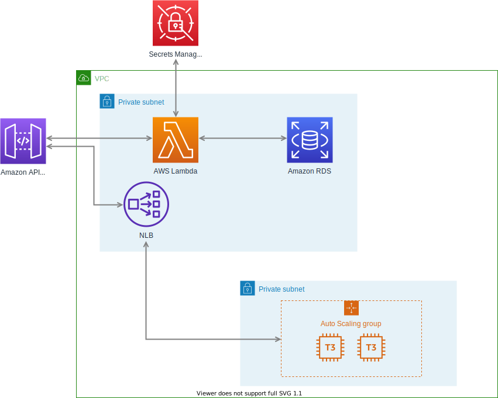

# Case1 Abstruct

<!--toc-->
## Table of Contents
* [Outline Diagman](#outline-diagram)
* [Definition of Term](#definition-of-term)
* [Explanation](#explanation)
  * [flow1: Connection with EC2 instances by VPCLink](#flow1:-connecton-with-ec2-instances-by-vpclink)
  * [flow2: Auth Structure by Authorizer](flow2:-auth-structure-by-authorizer)
<!--toc-->

## Outline Diagram

## Definition of Term
VPC Lambda
: Lambda function inside VPC

## Explanation
### flow1: connection with EC2 instances by VPCLink

### flow2: Auth Structure by Authorizer

